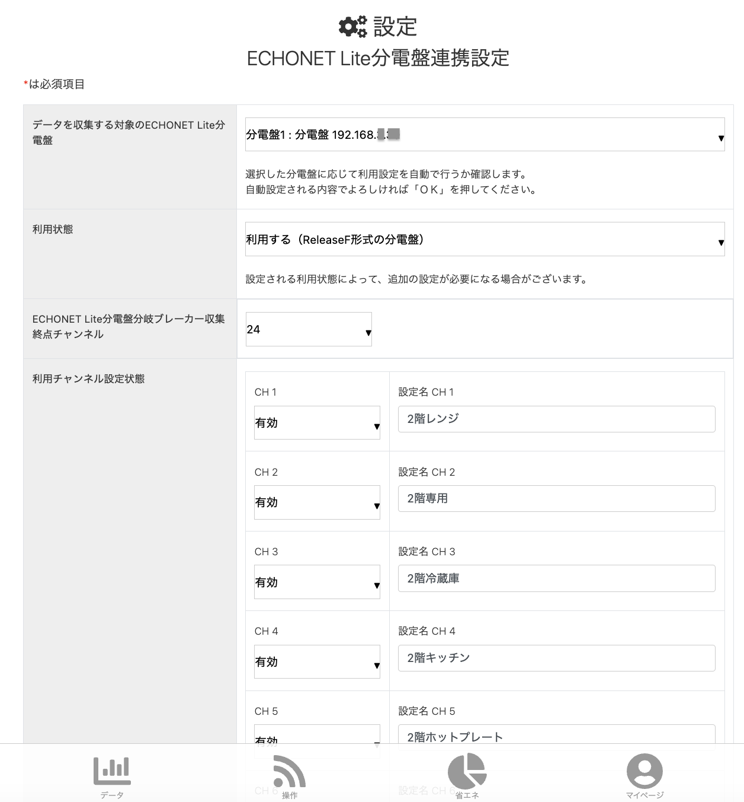

## Mirueco mini setup with eco-fan.jp

In Japan, one way to monitor your solar energy generation and energy use from your distribution board is to use the [Mirueco mini](https://portal.eco-fan.jp/product.html) and the eco-fan.jp website.  There is not that much information about it in English, so I thought I would describe my setup process.

If you have a distribution board with a ethernet adapter, then the signals from that system can be accessed by the Mirueco mini.  But there is only one ethernet port on the mini, so I connect it to an ethernet switch, and then connect the distribution board to the switch.  Finally, you need to connect the switch to the internet to access the eco-fan website.  To do this, I am using an old airport express which has a bridge connection back to an old airport extreme, which is connected to my main router.  The setup is detailed [here](https://portal.eco-fan.jp/pdf/EcoFan_OE.pdf).

Once you set that up, you can create an account on the eco-fan website.  When you register, you will provide a HEMS code from your mini that will allow the eco-fan website to connect to it.

When you do that, you should be able to login.  To actually connect with the distribution board, you need to go to settings and click on ECHONET Lite分電盤連携設定.  You should see the ip address for your distribution board in the first box.  For the channels, you should label them so that they match your distribution board setup.

