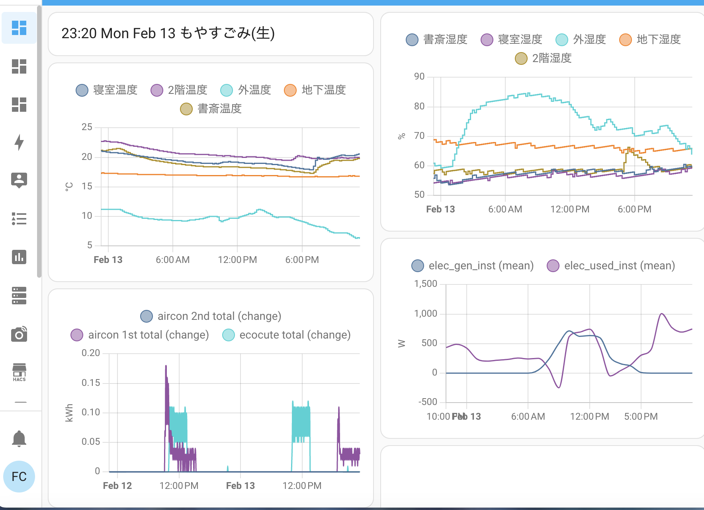

## Using Home Assistant in a home in Japan

This page details how to connect Home Assistant to various devices in a house in Japan.  I am using a synology NAS to host home assistant. 

1) [Amcrest AD410 doorbell with two way audio in home assistant](https://github.com/franklinr/homeAssistantJapan/tree/main/amcrestDoorbellHomeAssistant)

2) [Monitoring an air conditioner through a distribution board using echonetlite and MQTT](https://github.com/franklinr/homeAssistantJapan/tree/main/EchonetliteMQTT) 

3) [Time/Date and Garbage reminder](https://github.com/franklinr/homeAssistantJapan/tree/main/TimeGarbageReminder)

