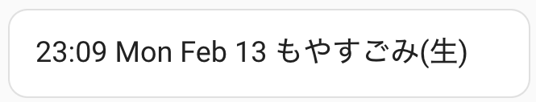

## Time and Garbage Reminder



Create a markdown card and insert this as the code
```
type: markdown
content: >-
  <font size=4px>
  {{ now().strftime("%H:%M %a %b %d") }}
   
  {{garbageDays[now().weekday()] }} </font>
```
